# 新生赛全面经验总结

[TOC]


## 前言

希望本次比赛的经验能够继续传承下去吧。

也希望以后的比赛能越办越好。

这篇文章写于2019年新生赛举办之后，希望利用这次比赛，总结一下准备一场ICPC赛制的比赛，都需要做好哪些事情，供后人参考吧。

### 读懂本文需要的前置科技树

默认阅读本文的人，已经具备以下前置科技：

1. 服务器的部署，linux下命令行的基本操作
2. 对ICPC赛制有起码的了解
3. 最好有过部署服务器的经验
4. 有耐心解决随时可能遇到的问题，善用搜索引擎
5. 最好会一点python/正则表达式，能够让你处理一些杂活的时候事半功倍

没有这些科技？找人帮忙完成需要这些技能的部分就好了嘛。

（有一说一，作为计科学生，强烈建议学一下这些）

### 在武汉大学举办一场比赛所需的至少的硬件软件

#### 服务器

服务器方面，至少有以下要求，**操作系统统一选择Ubuntu，版本最新版就OK。**：

1. 一台8核16G内存，或更高配置的服务器，作为比赛交互界面。
2. 一台任意配置的服务器（xx云学生机都可以），作为连接ICPCtools的CDS。
3. 若干台1核2G的服务器，作为远程评测机。

#### 其它设备

如果你需要使用ICPC tools的话，至少需要带两台满足如下条件的设备到比赛现场：

1. 安装好了ICPCtools的机器
2. 拥有64位Java运行环境

比赛时，最低配置为两台设备，两台设备的作用如下：

1. 后台机：运行Presentation Admin，Balloon Utility，同时登陆domjudge后台。
2. 前端机：运行Presentation Client，作为比赛直播用机。
3. （可选）直播姬：运行哔哩哔哩直播姬。

如果你需要进行比赛直播的话，是不是也得要一部摄像头呢？

#### 软件

1. FileZila：一款能进行FTP传输的软件。
2. PuTTY：连接远程服务器用shell。
3. 哔哩哔哩直播姬：用于直播。

## Step 1: 各种环境配置

### domjudge简介

目前国内区域赛使用的比赛环境，基本上都是domjudge，因此这里给出使用domjudge的方法。

domjudge是一套专用于ICPC赛制的评测系统，而且可以兼容ICPC tools，所以赛后还能直接用ICPC tools滚榜，比赛中也可以使用它来提供一些高级的直播。

domjudge总共由两部分构成：

- domserver，提供与选手的交互界面，以及管理后台，也就是提供“Web interface”的设备，实际比赛建议高配置，因为并发量比较大（想想都能明白）。
- judgehost，评测机，接受domserver发来的评测任务，返回评测结果。这里建议使用的配置是多台1核2G的服务器。2019年新生赛总共启用了8台这样的judgehost，体验极好，基本没有评测队列被卡住的情况。而2019年的ICPC南昌区域赛则启用了15台。

目前来说，docker下安装domjudge比较方便，所以建议使用docker安装domjudge。

domjudge的安装与配置，还可以参考下面的文章：

[1]  https://www.runoob.com/docker/ubuntu-docker-install.html  Ubuntu Docker 安装

[2] https://hub.docker.com/r/domjudge/domserver/  domjudge docker镜像的使用说明

[3] https://www.domjudge.org/docs/admin-manual.html  domjudge 官方开发文档

[4] https://github.com/DOMjudge/domjudge/wiki/Connecting-the-ICPC-Tools-with-DOMjudge  将CDS与你的domjudge连接的方法（启用ICPC tools 必备）

### 购置服务器

按照前文硬件要求，购置服务器。

以腾讯云为例，下面说明一些注意事项。

购买界面，需要至少注意以下内容：

1. 购买方式：按量计费。
2. 镜像：Ubuntu 最新版本（如果是重新配置的话，选择自定义镜像，这个稍后会谈到）
3. 公网带宽：按带宽计费，最低带宽就够。

（注意：武汉大学ICPC集训队有自己的服务器，可以充当domserver使用）

注意：虽然你比赛前购买到比赛结束这么好多天看上去好贵，但你只需要配置好，保存镜像就可以走人了。

### 安装docker

> **注意：武汉大学ICPC集训队的服务器已经安装好了docker，可跳过此步骤，但在评测机上仍然需要这一步骤。**


### 安装domserver

> **注意：在武汉大学ICPC集训队的服务器上已经有配置好的docker容器的mariadb和domserver，建议stop之后rm掉重装**

#### 启用cgroup

> **注意：在武汉大学ICPC集训队的服务器上可跳过这一步骤。**

domjudge的配置，必须启用cgroup。

首先，用vim打开`/etc/default/grub`

```bash
sudo vim /etc/default/grub
```

然后，把`GRUB_CMDLINE_LINUX_DEFAULT`字段修改如下（如果存在字段`GRUB_CMDLINE_LINUX`，也修改为同样的内容）：

```bash
GRUB_CMDLINE_LINUX_DEFAULT="quiet cgroup_enable=memory swapaccount=1"
```

保存退出，接着，运行以下两条指令，重启服务器：

```bash
sudo update-grub 
sudo reboot
```

对于centos7来说是这样的：

```bash
sudo grub2-mkconfig -o /boot/grub2/grub.cfg 
sudo reboot 
```

重启后，用vim打开`/proc/cmdline`文件，检查是否有我们输入的指令，有的话表示配置成功。

#### 安装domserver

参考文章[2]，进行下面步骤：

首先，安装数据库：

```bash
docker run -it --name dj-mariadb -e MYSQL_ROOT_PASSWORD=rootpw -e MYSQL_USER=domjudge -e MYSQL_PASSWORD=djpw -e MYSQL_DATABASE=domjudge -p 13306:3306 mariadb --max-connections=1000
```

如果没有任何报错的话，按下`Ctrl+C`退出，然后执行`sudo docker start dj-mariadb`让数据库在后台运行。

接下来，安装domserver本体：

```bash
docker run -v /sys/fs/cgroup:/sys/fs/cgroup:ro --link dj-mariadb:mariadb -it -e MYSQL_HOST=mariadb -e MYSQL_USER=domjudge -e MYSQL_DATABASE=domjudge -e MYSQL_PASSWORD=djpw -e MYSQL_ROOT_PASSWORD=rootpw -e CONTAINER_TIMEZONE=Asia/Shanghai -p 12345:80 --name domserver domjudge/domserver:latest
```

注意：此处给出的指令相比原文，对domserver的配置多了一个时区的设置。如果你要修改数据库默认用户和密码的话，请确保匹配。

如果没有任何报错的话，按下`Ctrl+C`退出，然后执行`sudo docker start domserver`让domjudge在后台运行。

现在，domserver宣告安装完毕了。打开网址`http://[服务器IP]:12345/`，就能见到domjudge的网页交互界面了。

#### 登陆管理员账号

执行以下代码，你就可以获得管理员账号：

```bash
docker exec -it domserver cat /opt/domjudge/domserver/etc/initial_admin_password.secret
```

点击domjudge界面的login，账号选admin，密码选择你刚刚得到的密码，登陆进入管理员界面：

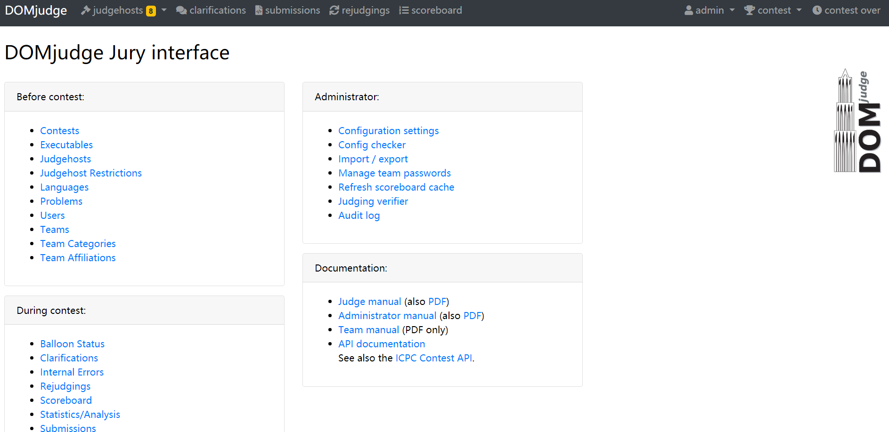

打开user界面，选择admin用户，点击edit，**只修改默认密码为你需要的密码**，save之后退出。

**在此之后，请一定不要忘记admin的密码，最好在文件中备份。**

### 安装judgehost

首先，我们先买下一台1核2G的服务器，对它进行配置。

> **注意：如果你使用武汉大学ICPC集训队的服务器作为domserver，那么比赛网址必须启用https网址，也就是https://contest.whuacm.vo-ov.cn:8080/。**

#### 启用cgroup

方法同domserver。

#### 配置judgehost账号

打开domserver的界面，进入user一栏，和修改admin账户的方法一样，点击judgehost，再edit，设置你的密码。**同样，请牢记这个密码，最好也能备份。**

#### 安装judgehost

登陆我们准备好的评测机（而不是domserver）

首先在评测机上安装docker，步骤与前文一致。

docker安装完毕之后，输入如下指令：

```bash
sudo docker run -itd --privileged -v /sys/fs/cgroup:/sys/fs/cgroup:ro --name judgehost-0 --hostname judgedaemon-0 -e DAEMON_ID=0 -e CONTAINER_TIMEZONE=Asia/Shanghai -e DOMSERVER_BASEURL=[比赛网址] -e JUDGEDAEMON_PASSWORD=[前文设置的judgehost的密码] domjudge/judgehost:latest
```

其中，judgehost-0为docker容器名，hostname为domjudge端评测机的名字，**不同的评测机这一项必须不一致**。

打开domjudge界面，查看judgehost界面是否多出了一个登陆了的judgehost，如果有的话，说明配置成功。

> **注意：请多观察一段时间，judgehost正常情况下应该会每几秒就login一次。**

#### 一点小细节上的修改

在新生赛的配置中我们发现，如果domserver和judgehost之间的连接在短时间内传送了较大数据的话，可能会导致评测机崩溃，在咨询了15级队长后，给出了下面的解决方案：

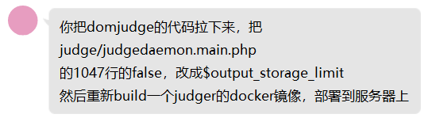

这个代码文件在GitHub上的位置： https://github.com/DOMjudge/domjudge/blob/master/judge/judgedaemon.main.php#L1047 

> 后记：这句话的位置现在可能不一定在此，请仔细寻找……

这个代码文件在judgehost容器中的位置：`/opt/domjudge/judgehost/lib/judge/`

找到这个源文件，本地修改需要修改的位置，然后上传到你的judgehost的根目录（可以使用FTP，如FileZila）。

随后，将该文件导入judgehost容器：

```bash
sudo docker cp ~/judgedaemon.main.php judgehost-0:/opt/domjudge/judgehost/lib/judge/
```

其中，judgehost-0是docker容器的名字，你需要根据实际情况进行调整。

然后运行 `sudo docker restart judgehost-0`重启评测机。

同时，打开domjudge的界面，到 `Configuration settings`处，将 `output_storage_limit`改成256。

 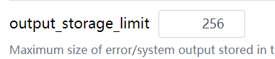

### 保存镜像

服务器好贵的，前文提到的配置可能维持一天需要上百元，但你又不可能只在比赛头一天进行配置。所以可以提前配置好，然后保存镜像，这样比赛当天就能复原。

在保存镜像之前，确保你已经完成上述所有配置

对于xx云，你直接可以找到保存镜像的位置，适当的进行命名。然后保存镜像。

保存完镜像之后，就可以销毁服务器了，这一步的目的是避免浪费钱。

任何时候需要进行修改时，只需要重新购买一台服务器，然后在购买界面选择自己当年载入的镜像即可。

### 准备ICPC tools

#### 什么是ICPC tools？

ICPC tools是ICPC官方提供的一系列小工具，可以极大地提升自己办比赛的游戏体验和逼格。

 https://icpc.baylor.edu/icpctools/  ←官方界面

ICPC tools还挺多的，这里主要介绍用得到的几个：

- Resolver： 滚榜工具，用于赛后滚榜。
- Balloon Utility： 用于打印气球提示的工具。
- Presentation Client：用于比赛时直播榜单，评测队列等的客户端，部署在连接现场投影仪的设备上。
- Presentation Admin：用于控制所有的Presentation Client, 请部署在任意一台后端机上。
- Contest Data Server (CDS)：一个控制比赛数据的服务器，部署在前面提到的需要部署CDS的学生机上就OK。关于CDS的配置方法请参考文章[2]。

进入链接： https://pc2.ecs.csus.edu/pc2projects/build/ ，下载上述工具的最新版本的压缩包，解压到对应的设备上。如果是远程部署到服务器上的话，请使用FTP/SFTP。

#### 环境配置

**所有运行ICPC tools的设备都需要包含java环境。**

#### 字体设置（中文显示必需）

**如果你的队名或者校名包含中文，请务必指定字体，否则将无法正常显示！**

运行滚榜工具（resolver），直播工具（presentation client）的设备，如需中文显示，必须指定ICPC_FONT。

对于Windows系统，添加环境变量，变量名：ICPC_FONT，值："Microsoft YaHei UI"（含引号！）

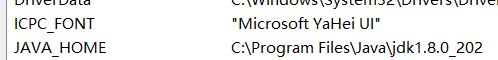

对于Ubuntu系统，指令如下：

```bash
export ICPC_FONT="NotoSerifCJK-Light"
```

到此，所需的基础环境，基本都搞定了。

## Step 2: 准备一场比赛

到目前为止，我们还只是完成了基本设施的搭建，就像大楼目前只打好了地基一样。

现在开始，才是真正的去配置一场比赛了。

### 前置：如果你的题目有大文件数据……

1. 上传试题的时候，请拉大服务器的带宽。
2. 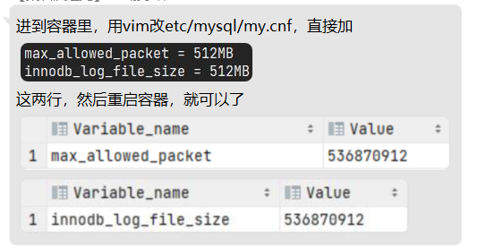

### 准备试题

比赛最核心的东西，当然是出题啦。

对于每一道题，你需要准备好如下的目录：

首先会有一个子文件夹叫`data`，里面又有两个子文件夹，分别是`sample`和`secret`。

在`sample`文件夹里存放的是本题的样例。作为样例的数据是允许选手在比赛中在`problemset`界面下载的。

每组样例的格式为：输入后缀名为`.in`，输出后缀名为`.ans`。

而`secret`文件夹存放的是后台评测数据。格式与`sample`一样。

回到根目录，根目录下还有三个文件：

- `domjudge-problem.ini`：是一个**必备**的配置文件，一般来说，它长这样，你可以直接创建一个文本文件，输入以下内容：

  ```ini
  timelimit='1'
  ```

  这表示此题时限为1s，一般来说，这么多就够了，除非你需要设置special judge的信息之类的。

- `problem.pdf`：这是你的题面文件。

- `problem.yaml`：同样为配置文件，你可以直接创建这么一个文本文件，输入这些内容：

  ```yaml
  #这是一条注释
  name: '仓鼠与奶茶'
  #这是题目名称
  ```

下面，给出一个问题的目录格式的一个示范：

```yaml
./p233/data/sample/0.in
./p233/data/sample/0.ans
./p233/data/sample/1.in
./p233/data/sample/1.ans
./p233/data/secret/0.in
./p233/data/secret/0.ans
./p233/data/secret/1.in
./p233/data/secret/1.ans
./p233/domjudge-problem.ini
./p233/problem.pdf
./p233/problem.yaml
```

还是不知道一个题目应该有哪些内容？

domjudge给出了一些例题，你可以导出这些题的题目包，按照它的格式来嘛。

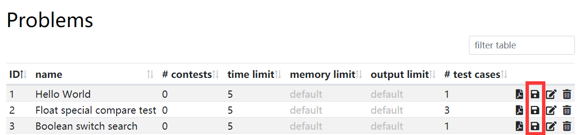

最后，把上述文件压缩为一个压缩包，并命名为`p**.zip`，其中`**`是一个题目ID，题目ID都是唯一的，所以你需要参照`problem`界面已有的题目，确定下一个题目ID是什么。

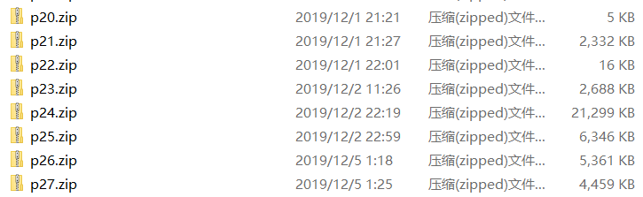


> **注意：最好在文件夹内全选文件，然后右键压缩，这是一个容易出现问题的地方，因为直接压缩文件夹的话，你原本的根目录，会成为zip包内的一个子文件夹，从而造成问题！**


在打包好所有题目之后，进入`problem`界面，到最下方逐个导入你的题目包。

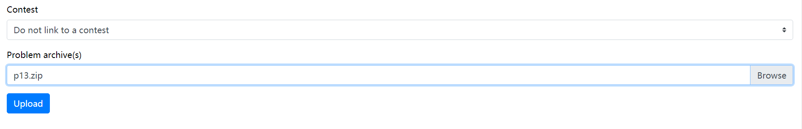


> **注意：contest处选择Do not link a contest。**


### 创建比赛

进入contest界面，点击最下方的进入创建比赛。

下面对配置中的选项逐一做出解释：

- Shortname：比赛的小名，只能使用英文，出现在界面右上方。

- Name：比赛的正式名字。

- Activate time：比赛的激活时间，在比赛激活之后各类API才能访问比赛，选手才能看到并进入此比赛的界面。建议设置为比赛开始之前所有准备工作做完的时刻。

- Start time：比赛的正式开始时间。

- Scoreboard freeze time：封榜时间，设置为比赛结束前一个小时即可。

- End time：比赛结束时间。

- Scoreboard unfreeze time：比赛榜解封时间，建议设置在比赛结束后2-3小时即可。

- Deactivate time：比赛解除激活状态的时刻，在此之后选手无法进入比赛界面，API也无法再访问本比赛。 

  

> **注意：比赛时间轴除非遇到突发情况，原则上一旦确定，请不要再进行修改，否则可能会导致ICPC tools运行出现问题！**

下面还有几个选项，保持默认就好。

接下来，导入题目：

每次点击创建一个新题目。

你需要设置的东西包括：题目（所以要事先导入题目），题号（A-Z的一个字母），得分（默认为1，除非你要设置子任务，搞成IOI赛制），题目气球颜色。其它东西保持默认就好。

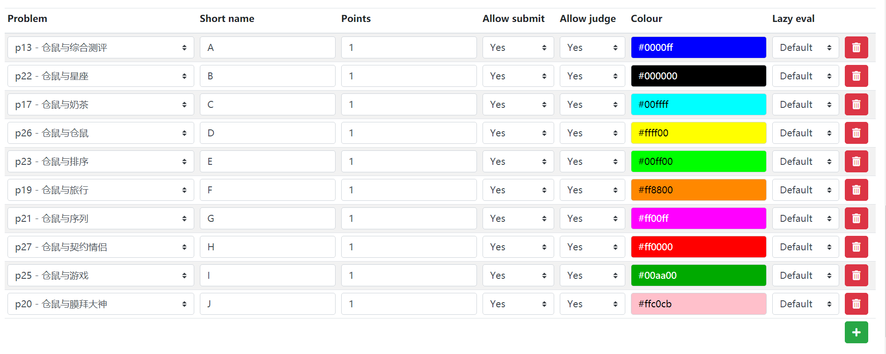

最后点击按钮，保存比赛基本配置。

> **注意：对于正式比赛，上述设置一旦完成，最好不要再进行任何变动！！！！**

### 组织验题

需要验题？

你可以参照上述方法，配置一个“验题赛”，然后组织出题组的同学们提交这个问题。

> **注意：验题赛一定要在正式比赛Activate之前Deactivate，或者在此之前删除。**

验题账户的创建方法：

进入team界面，创建一个队伍。

External ID填一个用不到的team编号（如team999），Team name随意，category选择system。

再进入user界面，点击创建新账户。

user name和full name可以填jury，密码自定，Roles选择Team Member，绑定team界面选择刚才建好的team。 

然后就可以用这个账号，登陆验题赛，提交题目以供验题以及评测机的配置。

> **注意：如果需要验题，可以在验题期间只开启一台评测机，同时观察评测是否存在问题，一旦出现问题，此时可以及时解决。** 

### 准备账户

> **注意：最好在确定了报名名单，或者报名名单定得差不离了之后再进行下面这一步！！！**

domjudge可以批量导入队伍与账号数据。

#### 批量导入分组

你可能需要将选手进行分组，那么你就需要导入这些分组信息。

为此，你需要准备一个`group.tsv`，它大概长成这样：

```
groups	1
1	System
2	Self-Registered
3	Participants
4	Observers
```

tsv是“tab separated values”的缩写，顾名思义，文件中所有空格其实都是一个个制表符`tab`。

首先，它的第一行一定是`groups	1`，表明它是一个分组文件。

接下来每一行代表一个组别，第一个数字表示这个组别的编号，后面的文字是这个组别的名字。

注意：组别的编号必须独一无二。

下面是新生赛的`group.tsv`举例：

```
groups	1
1	System
2	Self-Registered
3	Participants
4	Observers
7	萌新组
8	专业组
9	非正式参赛组
```

接着，进入`Import / export`界面，导入数据。

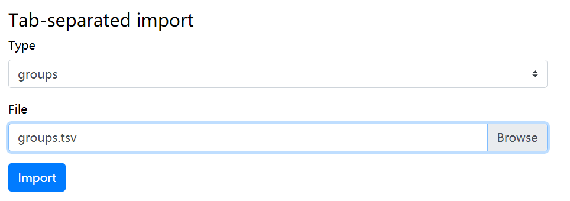 

#### 批量导入队伍

类似于导入分组，导入队伍需要准备一个`teams.tsv`文件。

这里首先给出新生赛的`teams.tsv`的示例：

```
teams	1
1	team001	7	徐淇	武汉大学	WHU	CHN	WHU
2	team002	7	王舒远	武汉大学	WHU	CHN	WHU
3	team003	7	万月	武汉大学	WHU	CHN	WHU
181	team181	8	许昊林	华中农业大学	HZAU	CHN	HZAU
182	team182	9	*黄哲威	北京大学	PKU	CHN	PKU
183	team183	8	俞智缤	武汉理工大学	WUT	CHN	WUT
184	team184	8	张志伟	武汉理工大学	WUT	CHN	WUT
```

首先，第一行是`teams	1`，表示这是一个队伍信息文件。

然后每一行的每一项的意义如下：

| 顺序 | 项目内容                                                     | 示例         |
| ---- | ------------------------------------------------------------ | ------------ |
| 1    | 队伍ID，必须唯一                                             | 1            |
| 2    | 队伍的External ID，用于与账号关联（建议使用team%03d的格式）  | team001      |
| 3    | 队伍对应分组ID                                               | 7            |
| 4    | 队伍名                                                       | 珞珈山老演员 |
| 5    | 队伍所属院校                                                 | 武汉大学     |
| 6    | 院校缩写，用于滚榜显示，**也可以直接赋予学校本名（如果你希望滚榜显示全名）** | WHU          |
| 7    | 国籍代码（遵循某一标准的三个大写字母表示的国家）             | CHN          |
| 8    | 院校exid，暂未发现实际意义，可以没有                         |              |

与group一样，导入这个文件就能上传所有队伍了。

#### 批量导入账户

这里你需要准备一个`accounts.tsv`文件，下面同样给出示例：

```
accounts	1
team	张成磊	team201	zwz1hclj
team	曹实	team202	rcjf5ik7
team	方圣	team203	u9vgusco
team	*屠啸雷	team204	1ivoyftf
team	冯立冬	team205	q6g3af6r
team	张宁池	team206	12xpupxg
team	戴梦德	team207	4zb5v215
team	罗云祥	team208	s6tq82q7
team	*张炜琦	team209	6i1gdmlr
team	邱卓妍	team210	3i9oj2aw
```

首先，第一行是`accounts	1`，表示这是一个账号信息文件。

然后每一行的意义如下：

| 顺序 | 意义                                              | 示例                                          |
| ---- | ------------------------------------------------- | --------------------------------------------- |
| 1    | 账号身份                                          | team, judge, admin, analyst（默认为team即可） |
| 2    | 用户名称                                          | *二价氢，无向秃                               |
| 3    | External ID，与队伍关联（建议使用team%03d的格式） | team233                                       |
| 4    | 账号密码                                          | 自定                                          |

与group一样，导入这个文件就能上传所有账号了。

> **注意：**
>
> 1. **如果你服务器配置不足，上传账号比较慢，如果出现30秒运行超时报错，可以把已上传的部分从文件里删除，然后再上传下一部分。（新生赛实际测试时，每30秒大约可以上传50个账号）**
> 2. **上传完账号之后，可以尝试登陆若干账号，验证是否成功。**
> 3. **真的在账号上传之后发现需要变动的话，直接打开相应的界面修改or添加就好。**

### 将CDS连接到domjudge

参考文章： https://github.com/DOMjudge/domjudge/wiki/Connecting-the-ICPC-Tools-with-DOMjudge 

#### 准备cds文件

从官网下载下来ICPC tools中的cds之后，将其解压在CDS服务器的根目录，或者本机的某个位置。

#### 建立CDS用户

在domjudge中创建用户，用户名为icpccds，密码自定，赋予admin, jury, balloon, api_reader, api_writer, api_source_reader权限。

然后，修改cds根目录下的`\usr\servers\cds\config\cdsConfig.xml`为如下内容：

```xml
<cds>
  <contest location="【一个存在合法目录，用于的保存比赛数据】" recordReactions="false">
     <!--只要这个目录真的存在，并且路径合法就行！ -->
    <ccs url="http://{带端口号的oj链接}/api/v4/contests/{比赛id}" user="icpccds" password="******"/>
  </contest>
</cds>
```

#### 尝试链接domjudge

进入cds根目录下的bin文件，运行服务器：

Windows:

```bash
server.bat run cds
```

Linux:

```bash
chmod 777 ./server
./server run cds
```

待完全启动之后，尝试访问`https://[CDS的IP]:8443`，如果你是在本机上部署cds，则访问`https://localhost:8443`。

如果能够访问成功无报错，则证明配置正确。

如提示账号密码，请参见`\usr\servers\cds\users.xml`。

### 导入院校照片

院校照片总共在2个地方需要：

1. domserver，以便提供现场选手界面的院校校徽。
2. CDS，以便在直播投屏上使用院校校徽。

#### 导入校徽到domserver

首先准备好各校校徽，**统一使用png格式**。

打开domjudge，找到每一个学校的ID，将该学校的校徽保存为`[此学校对应的ID].png。`

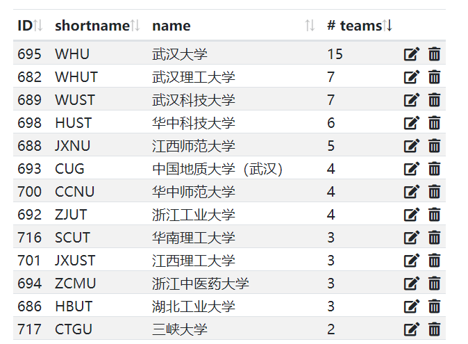

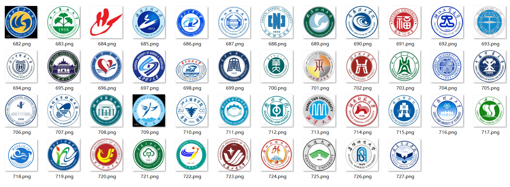

然后上传到domserver的安装目录下的`/webapp/public/images/affiliations`文件夹内即可。

如果你的domserver是按照上述流程，安装在docker里面的话，可以先创建好一个`affiliations`文件夹，通过FTP上传到服务器根目录，然后执行下面的语句，拷贝到docker容器内：

```bash
docker cp ~/affiliations domserver:/opt/domjudge/domserver/webapp/public/images
```

> **注意：**
>
> 1. **如果你后来发现校徽有问题，需要修改校徽的话，可以直接覆盖原文件后刷新。如果发现刷新后无变化，可以在docker容器内启用bash，重启容器内的nginx。反复数次。**
> 2. **最好是背景透明的PNG文件，如果不确定各校校徽，最好与各校联系好确认。**

#### 导入校徽到CDS

对于CDS，你需要准备一个`organizations`文件夹，对于每一个学校，创建一个与domjudge上该学校对应数字ID相同的子目录，在子目录内放置名为`logo.png`的该校校徽。

然后，将这个文件夹放置在前面CDS设置中的contestData目录内。

### 安排座位

这里你就需要根据实际的比赛场地，写一个脚本来随机生成座位了，建议你的脚本至少生成两个文件：

1. 现场座位图。即整个表是现场座位布局，每一个座位上写着队伍名字。
2. 座位列表，列表形式给出每个队伍的座位号。

（就是函数与反函数的关系嘛）

## Step 3: 物资与硬件准备

### 比赛其它物资准备

#### 气球

这个不用多说了，根据比赛规模进行购置即可。

同时可以思考一下一血气球如何准备。一血气球一般有这么几种解决方案：使用字母气球，购买氦气，在正常气球内再套一个气球等。

#### 奖品

根据预算，有多少整多少。

#### 证书

用PS自己设计一个，然后联系打印即可。注意：打印时要求使用铜版纸。

#### ※席卡

（新生赛没有，但可以考虑以后整一个）放在每个座位前标识这个座位的队伍是谁。

**席卡的快捷准备方式：**

step1：确定席卡需要显示的信息，以确定一张席卡需要占用表格多少行。

step2：新建一个excel表格，在每一行内输入对应的信息。

step3：页面布局->纸张方向->横向，再点击一次打印（不要真的打印，出现了打印预览即可）

step4：调整行高，列宽（可能还需要调整一下字体使得更加美观），保证席卡的内容**恰好**覆盖一张纸。

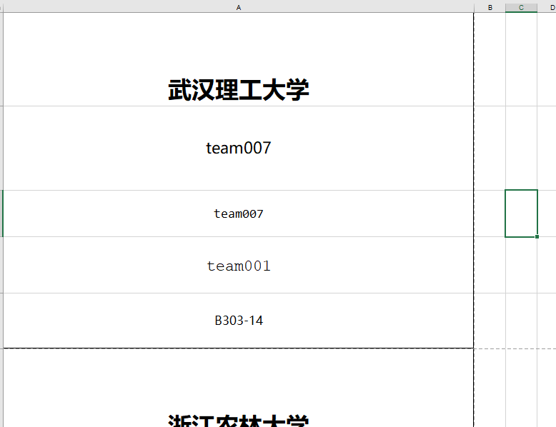


step5：将各队伍信息，准备在一个文件内，一行一条信息。

```
武汉理工大学
team007
team007
team001
B303-14
武汉仓鼠大学
三只仓鼠
Three Hamsters
team002
B303-25
```

step6：食我格式刷！！！

#### 有关表格

至少需要这么几张表格：

签到表，用于现场签到

上文提到的座位列表，按顺序给出每个参赛选手的座位，便于组织发气球工作。

队伍与密码的对应表格，以防选手遗失密码条。

#### ※密码条

可以参照CF上的密码条的htm文件格式，写一个自动生成同样格式的密码条的脚本（我给你了）。

```python
import re
import random
temp='''
<div class="card %s">
    <div class="participantName">%s</div>

    <p>
        账号:
        <code>%s</code>
        密码:
        <code>%s</code>
    </p>

    <p>
        比赛网址:
        <code>whu2020.contest.codeforces.com</code>
        座位号：
        <code>%s</code>
    </p>
</div>
'''

header='''
<html><head><meta http-equiv="Content-Type" content="text/html; charset=UTF-8"><style>
    .card {
        font-family: "Helvetica Neue", Helvetica, Arial, sans-serif;
        font-size: 28px;
        width: 800px;
        /*background-color: rgb(230, 230, 230);*/
        border: 1px solid gray;
        border-radius: 5px;
        padding: 20px;
        margin: 20px;
    }

    .participantName {
        font-size: 30px;
        font-weight: bold;
		color:black;
    }

    code {
        font-family: "Calibri";
        color: dimgray;
        padding: 0 20px 0 0;
    }

    p {
        margin: 10px 10px 10px 0;
    }

        .break {page-break-after: always;}

    .siteLink {
        font-weight: bold;
        /*background-color: rgb(91, 192, 222);*/
        color: gray;
    }
</style>

</head><body>
'''

tail='''
</div>
</body></html>
'''

def rearrange(stuList):
	while(len(stuList)%6!=0):
		stuList.append("1\t1\t1\t1\t1\t1\t")
	newList=[]
	step = (len(stuList)+5)//6
	for i in range(step):
		for j in range(i,len(stuList),step):
			newList.append(stuList[j])
	return newList

if __name__=='__main__':
	stuList = open('/seatList.tsv','r',encoding='utf8').read().split('\n')
    #stuList格式为姓名（队名） 账号 密码 座位号，可根据实际情况自行修改
	res=header
	stuList = rearrange(stuList)#重排，保证手撕之后叠起来恰好顺序
	num=0
	for stu in stuList:
		tmp=stu.split('\t')
		try:
			name=tmp[0]
			account=tmp[1]
			pwd = tmp[2]
			id=tmp[3]
		except:
			continue
		if(num==5):
			res+=temp%('break',name,account,pwd,id)
		else:
			res+=temp%('',name,account,pwd,id)
		num=(num+1)%6
		#f1.write("%s\t%s\t%s\t%d\n"%(name,account,pwd,id))
	res+=tail
	#f1.close()
	open('密码条.html','w',encoding='utf8').write(res)
```


#### 试题题面

如果你在polygon上命题，可直接从polygon上导出，可以插入一个精致的封面。

#### 路标指示牌，签到处比赛场地提示

随便做两张就行

#### 选手须知

建议做一份选手须知，告诉各位选手如何连接校园网。

#### 题解PPT

一份用于讲题的PPT。

### 配置比赛现场环境

一定要在比赛开始之前1-2天来现场配置比赛环境。

配置比赛环境主要就是在学校机房设置一下防火墙，开启防火墙之后设置一下出站规则，只允许访问比赛网址对应的IP即可。

配置好镜像之后，关联到现场机器，然后**多实验**几台机器，确保能够实现：

1. 能够进入校园网登陆界面
2. 能进入比赛网址
3. 不能访问其它链接

## Step 4: 临场场控

### 启用镜像

比赛前一天或者比赛当天上午，上你的云服务器供应商，买服务器，支付类型选择按量计费。

按照前文配置购置domserver以及judgehost。

**在操作系统选择中，选择我们之前配好的镜像，这样每一个新买的服务器都跟我们当时的配置一样了。**

### 签到

事实证明，签到处只安排2个人是远远不够的。

建议提前分割密码条，提高签到效率。

### 气球发送

使用ICPC tools内的balloonUtil可以打印气球提示。

在命令行里输入`./balloon.bat`启动工具。

如果不需要气球打印的话，打开jury界面的balloon界面也可以看到气球提示。

**每当出现一个气球时，发送这个气球的人，请点击这一行气球信息最右侧的小人图标，标记已发送，以免重复发送。**

### 配置直播

#### presentation Admin

在具备java环境的设备上启动presentatAdmin工具，连接CDS服务器。

（如果已搭建cds服务器，在web端也提供了控制presentationclient的界面，可省略这一步）

连接方法：进入presentationAdmin工具的根目录，输入如下指令：

#### presentation client

**请确保导入了ICPC_FONT环境变量，具体方法参见前文对ICPC tools的配置。**

在需要投影的投影机上启动presentationClient。

对于windows：

```bash
client.bat 1（如有多个client，则id递增）【CDS链接】 presentation 【presentation的用户密码】
示例：
client.bat 1 https://119.45.163.21:8443/ presentation FjZm6d
```

对于linux：

```
./client.sh 1（如有多个client，则id递增）【CDS链接】 presentation 【presentation的用户密码】
示例：
./client.sh 1 https://119.45.163.21:8443/ presentation FjZm6d
```

即可全屏播放想要的内容，可通过presentation admin或者CDS页面，控制client的播放内容。

**因此强烈建议admin使用额外的设备。**

## Step 5: 总结滚榜

### 赛后讲题

准备一份题解PPT十分关键，在讲题期间，可以在后台顺便完成滚榜的准备工作。

<del>讲题就是拿来为滚榜准备耗时间的</del>

### 赛后滚榜

滚榜主要使用resolver工具，对于使用resolver的设备，请确保该设备已正确导入ICPC_FONT环境变量，并具备Java环境。

#### Finalize比赛

进入domjudge界面，点击contest，将这场已经结束的比赛选中，点击“Finalize Contest”，即可结束比赛！

> 可能会出现不让你finalize的情况，大概率是因为选手提交还未测完，等待测完即可（同时提醒选手不要再提交代码）

#### 将resolver链接至CDS

进入resolver的根目录，输入如下指令：

Linux：

```bash
./resolver.sh 【CDS链接】 admin 【admin密码】 --presenter --singleStep
```

windows：将sh改成bat，去掉./即可。

```bash
resolver.bat 【CDS链接】 admin 【admin密码】 --presenter --singleStep
```

随后即可进入滚榜！空格==下一步，Ctrl+Q：退出。

> 更多未竟事宜，请参见resolver的使用手册。
>
> 滚榜工具不是很稳定，所以尽量避免在比赛开始之后执行一些特殊操作（如删除选手的提交/题目），以防止滚榜失败！

## 结语

感谢你能读到最后呀。

看上去挺长的，确实，准备一场比赛没有想象中的那么容易。

准备的过程也不会一帆风顺，但一步一个脚印来一定不会错。

加油，祝愿你能举办出一场完美的比赛！