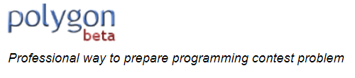
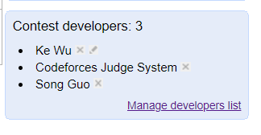

# CF自创比赛教程

Created by hamsterw

## 前言

其实很早就知道Codeforces是可以资瓷自己创建比赛，一位著名学长也使用过这个功能。

但是真正搞懂创建比赛的全流程，是在筹办我校校赛的时候，当时全程当工具人，为了研究清楚如何在这个平台上面办比赛，遭遇到了很多问题，撞得头破血流，而且并没有人帮助我解决这个问题。

最终，我还是一步步摸清楚了举办比赛的全部流程，本教程将介绍在CF上举办一次比赛从头到尾的全过程。

## 准备工作&介绍

Polygon是Codeforces背后的一个强大的题库系统，我们总是能在各大比赛的Announcement上见到对它的感谢。



如果你需要利用codeforces自己举办一套比赛，你需要：

**1.账号具备教练模式（Coach Mode）**

教练模式是CF针对身经百战见得多的用户的福利，在教练模式下你可以自己举办比赛。

如何知道自己是否具备教练模式？

切换到CF的GYM界面，在右侧边栏看看有没有这个，如果有，那就是开启新世界的按钮了。


如何获得教练模式？一般rating在2100以上（橙名）或者rating1900以上，且参加过至少10（20？记8太清了）的用户才会有coach mode。

**2.具有Polygon账号**

Polygon是独立于CF的一个平台，需要独立账号登录

[[https://polygon.codeforces.com](https://polygon.codeforces.com/)]([https://polygon.codeforces.com](https://polygon.codeforces.com/))

↑Polygon的链接

如果你没有Polygon账号，请先注册一个，点击register进入注册界面。


**3.具备你所需的题目的题面，数据，和标程等出题所需文件**

注意：CF的数据无需输出文件（即一般情况下的.out和.ans文件），原理是传入数据和标程，自动生成答案。

**5.有一个FTP传输程序（如FileZilla）**

我们会用到FTP来上传一些文件。

**6.有耐心**

流程挺多的，请富有耐心。

**7.汉语&英语水平能够读懂本教程**

## 编辑一道题的流程

打开polygon界面，点击login登录。


Attach session to IP的意思是将你的IP作为会话参数，可以阻止异地登录&多开。

> 出题是一件强调保密性与安全性的事情。

登陆后，点击页面上的“New Problem”，进入一个要求你输入题目名字的界面。

> 注意：这里的名字并不是最终的题面名称，只是起到一个ID的作用，此名字只能使用小写字母，数字，和减号（-），且最好能明确表示此题含义。
>


然后你就会进入CF的造题界面：


下面，首先对每个（主要用得到的）标签进行解释（关键标签会被加粗）：

1. **General Info**：基本信息，主要功能为指定输入输出，时间限制与内存限制。
2. **Statement**：题面。
3. Files：题目中用到的文件。
4. **Checker**：比较输出与答案的程序
5. Validator：判端数据是否符合题目格式的一个程序，在正式比赛出题中还是有帮助的，建议准备一个。
6. **Tests**：数据。
7. Stresses：压力测试，用于验证标程能不能顶得住。
8. **Solution Files**：题解。
9. Invocations：可以试跑标程。
10. Issues：如果出题工作是多人协作完成，你可以在这里标注还需要完成的任务。
11. **Packages**：打包题目，一切工作的最后一步。
12. Manage Access：如果你需要别的Polygon账户帮忙的话就得管理权限了。

接下来：介绍一下创建一道题的具体流程，实际创建题目的时候可以对照本段：

### Step 1: 填写基本信息

这一步主要是在一开始就弹出来的General Info界面（见上图），设置以下内容：

时间空间限制

输入输出文件（如果标准输出，就保持不动，即两项分别为stdin/stdout）

### Step 2: 撰写题面

点击进入Statement界面开始撰写题面。

首先会要求你选择语言，这里直接选择English，其他语言可能会出问题。

随后会进入一个文本编辑界面，下面对每个模块依次进行解释：

1. Encoding 编码，默认UTF-8即可。
2. Name 名称，这是真正的显示出来的题目标题。
3. Legend 题面，一般对应Background&Description。
4. Input format 即输入格式。
5. Output format 即输出格式。

其他模块一般用不上。

把你事先准备好的题面依次复制进各模块内即可。

#### Step 2-1: Latex


如上图所示，当你需要换行时，你需要额外空出一行。

编辑界面同时支持插入公式，只需在一对美元符号($)里输入你的公式即可。


上图中，$T \leq 20$，$n \leq 200$ 等公式即可使用这种方法生成。

因此，在用CF出题的时候，**强烈建议各出题人使用markdown编辑器，并且使用规范的公式**。

> T<=20       (x) 
>
> \$T\le 20\$ (√)

#### Step 2-2: 如何插入图片

当年这个问题搞得我痛不欲生，所以我觉得有必要介绍一下。

我们需要把图片导入题目文件内，才能在题面中使用图片。首先看到Statement界面的最下方，有一个添加文件的位置：


点击“Add Files”，上传你需要插入的所有图片。


这是插入成功之后的效果（默认显示时间为莫斯科时间（UTC +3），实际上是十点插入的）

然后，在编辑器中需要插入图片的地方输入以下代码：

```latex
\includegraphics{**.jpg}
```

\*\*.jpg即你上传的图片名，**无需添加任何路径**。


**使用示例**


#### Step 2-3: 预览

当你认为完成了一切编辑任务之后，请先点击最后的save按钮，养成保存的好习惯。

在保存之后，你可以预览你的题面，右上提供了三种格式的预览：


下面是 In HTML的效果图：


你可以反复操作，保存->预览效果->修改->保存->预览效果……直至你满意为止。

在In PDF效果中你可以看到生成的PDF题面，但如果你的题面设置中出现了问题，在生成PDF界面中可能会报错，如果出现了报错，请检查报错出现的对应位置，一般是符号问题，中文符号等问题。

### Step 3: 设置Checker

请打开checker界面。

虽然大多数情况下我们只需文本比对就能查阅答案，但是Polygon要求所有的输出都要经过checker程序比对，因此你必须设置好Checker程序（如果你的程序本来就需要Special Judge，那更不必谈）

好在Polygon提供了好几个预设的Checker，包括忽略行末空格空行（lcmp），或者逐字符比较等（fcmp），你可以在下拉框里找到这些预设。


上面就是一些预设的checker，附带了checker的说明。

如果你的题是special judge的话，相应地你需要上传你自己写的special judge。

设置好or传好之后，set checker即可。

#### Step 3-1: 设置Validator

Polygon中的一个特有机制，对于一个题目的输入数据，需要经过Validator验证是否与题面要求相符。

这就是个大模拟了，你需要写一个程序，验证你读进来的东西是否符合格式。

建议切到Validator界面查看一些示例，照葫芦画瓢来写。

### Step 4: 设置数据

请进入tests界面。

点击Add Test即可开始添加数据。

添加数据可以复制粘贴，也可以从文件传入。如果需要上传文件，请选择下面的“from the files”


请注意，**只需添加输入数据**，不要把输出数据也添加到里面了。

添加完毕之后，在Tests的界面，可以点击相应数据上的“Example”按钮，将这组数据设置为在题目中显示的样例。（所以说，你题面中的样例输入&输出是在这里上传&设置的）

#### Step 4-1: 使用Generator 生成数据

Polygon对单个上传的数据文件的大小有限制。当你发现需要上传的数据过大时，可以采取上传你的数据生成器来解决这个问题。

首先，我们进入Files界面。


我们找到这个位置，点击Add Files，上传你的数据生成器。

> 提示：
>
> polygon界面提供了一些generator示例，你可以学习它们的写法来写你的数据生成器。
>
> 此外，Polygon还提供了一个专供生成数据的头文件`testlib.h`, 此处不再赘述，有兴趣的话可以进一步了解它的用法。

随后，我们回到Add Test界面，将Type里的Manual改成Script。


在Script line里输入一个指令即可。

> Example说明：
>
> 你的源文件叫gen.cpp，需要传入一个参数13，那就可以用说明文字里的例子来输入。

### Step 5: 设置标程

进入Solution files界面，上传你的标程即可。

> 重要提示：
>
> **请注意把标程设置为标准输入输出**。

#### Step 5-1: 验证你的标程

进入Invocations界面。

点击进入测试界面，左边勾选你的标程，右边勾选测试数据（或全选），点击开始测试。

这一步的目的是确保时限&空间限制合法以及标程会不会炸，可以在General Info里修改这俩参数，也可以根据反馈结果调整数据or修锅，还可以上传暴力程序到solution files界面来检验暴力程序测试的结果。

### Step 6: 确认修改

**每一次对题目的修改后都要确认修改**

**每一次对题目的修改后都要确认修改**

**每一次对题目的修改后都要确认修改**

滚轮滚到右下方，找到一个叫“commit changes”的链接。


进入上面的界面，点击commit即可。

> 后记：有时候必须关注一下黄框框里的注意事项。这样才符合规范。

下面的打勾如果不打的话，每次commit都会给你发一封邮件，如果你不希望收到修改邮件的话，可以勾选它。

> 小插曲：
>
> 本人在参与2019 ICPC南昌站出题时，验题方在凌晨仍然在努力工作，一晚上我能收到近10封邮件。
>
> 再次向参与了2019ICPC南昌站以及其它赛站的出题&&验题方表示由衷的敬意。

### Step 7: 题目打包

**每一次对题目的修改后都要打包**

**每一次对题目的修改后都要打包**

**每一次对题目的修改后都要打包**

这是创建题目的最后一步。

点击packeges。


一般选择Standard或full都行，Full的题目涵盖更多内容，但是生成更慢，且生成的包更大。

等待一会，如果出现了一个状态为READY的包的信息，恭喜你，成功了。

如果没有，即显示为FAILED，请根据错误信息进行排查。

> 常见的fail原因：题面生成错误（题面的公式或者符号有些问题），标程错误（标程测试错误 ），数据未通过validator测试等。

**到此为止，一道题目的上传工作就结束了，重复以上步骤，把一套比赛的所有题目上传即可。**

## 组一套比赛的流程

组比赛的部分相对于组题目来说其实相对简单。

### Step 1: 填写基本信息

点击导航栏的“New Contest”，进入比赛生成界面。


填写几项基本信息，然后点击Create。

你填写的基本信息都会显示在最终的题面文件（statement）上面。

### Step 2: 导入题目

进入比赛编辑界面之后，导航栏下方有一个小小的链接——Add Problem。


点击它，进入导入题目界面。


然后在choose problem界面里，勾选本次比赛需要的题目，点击下方按钮确认。

随后，题目就会被全部导入比赛界面。

如果你需要重新编排题目顺序，点击右侧边栏中的“Renumerate problems”，重新编辑题号。

### Step 3: 打包&生成Descriptor

接下来就可以生成比赛所有相关的东西了。

#### Step 3-1: 生成题面文件


点击链接即可。

注意：如果你点击链接之后没有生成pdf，而是报了一堆错，很有可能是：

1. 题面公式有语法错误
2. 题目没有完成打包

总之，大概率是题目的问题，你需要回头检查题面，尤其是题面公式的语法错误，然后一定要打包！

**建议在这一步反复检查生成的题面文件是否包含错误信息，如果包含，请切回此题目的编辑界面，重新修改，并完成打包！**

#### Step 3-2: 生成完整比赛包（包含题目，数据，标程）


点击下面的Build full packages即可。

等待一段时间之后，点击最下方的“Download packages”就可以下载完整的比赛包了。

#### Step 3-3: 生成Descriptor

这是在CF上举办比赛所必须的一个文件。


点击“Download Descriptor”，就会蹦出一个新页面，上面有一段代码。


将代码复制下来，保存为contest.xml。

### Step 4: 在CF上创建比赛，并完成配置。

#### Step 4-1: 使CF拥有读取比赛权限。

这是我们在polygon进行的最后一个操作。



点击“Manage developers list”。


在弹出的这个界面中，list里加入“codeforces”，Access选择Read。保存。

#### Step 4-2: 创建比赛

好了，接下来的操作就可以全部在codeforces里完成了。

打开codeforces的gym界面，在右侧边栏找到这么一个东东，这是开启教练模式的选项：


图示表明已开启教练模式。

开启之后，gym的最上方会有一个创建比赛的链接，点击它。


 接下来是一堆密密麻麻的选项，逐个进行解释：

> **不用担心，创建比赛之后你还可以进行设置的。**


Training name: 顾名思义，比赛名称。

Contest format: 比赛形式，默认ICPC即可。

Start time: 开始时间。

Duration: 时长，单位分钟（默认的300分钟即为5小时）

Visibility: 可见性，你可以设置为个人可见（private）。**如果设置为Public意味着全CF用户都可以看得到！**


paricipation type: 参赛形式，是以队伍报名？还是以CFID个人报名？（建议默认）

Freeze period: 封榜时长（例如最后一个小时封榜，就填60）。

Unfreeze time: 什么时候解除封榜？

Is practice allowed?: 是否允许赛后交题目？

Is virtual allowed?: 是否允许用户在比赛后开Vitual Participation？

Is out of competition allowed?: 是否允许打星参加？

Is self-registration allowed?: 是否允许自行报名？

Can non-registered view the contest?: 没注册的能否看题？看榜？

Can participants view common status?: 选手比赛中途能否看到其他人的评测记录？（默认应该点否）

Contest testdata policy: 能不能看测试数据？不能看，只能看通过的测试，全都能看。

Allow view other submissions to: 谁能看别人的提交代码？


这一大部分其实都无关紧要。

然后就可以点击Create training了。

#### Step 4-3: 导入试题

点击之后，我们就会进入比赛的编辑界面，此时应该是一片空白（因为没有导入题目）

CF导入题目的原理，是将刚才polygon里面我们导出的descriptor文件导入到比赛当中，而导入需要使用到ftp。

打开你的FTP程序（这里以Filezilla为例），在地址栏输入：

ftp://taskbook.codeforces.com/**比赛ID**/sandbox

比赛ID就是你打开比赛界面之后，链接里的那串数字。（链接格式都是codeforces.com/gym/XXXXX）


用户名，密码输入自己的CF账号。如果要填写端口的话填写21 。

随后，把刚才Step 3-3保存的contest.xml上传到根目录。


上传完成之后，回到比赛首页，点击“Update Contest”。


过一段时间，刷新一下，题目就全都出来了！

如果需要对创建比赛时出现的那些选项进行修改，你需要进入在上面的“Edit”界面。

#### Step 4-4: 让更多人参与管理

点击Adm界面。


managers: 管理员，可以参与修改题目一切设置，**但manager也必须拥有教练权限**。

Spectator: 可以生成一个外榜链接。

### Step 5: 用户报名

如果仅限CF内部ID参加的话，只需在“Adm.”界面点击invite user就行。

但事实上，举办比赛大多是情况下只是借用CF这个平台，实际上的选手报名可能没有CFid。可能需要我们申请临时账号参加比赛。所以，我们需要进一步介绍如何进行这些操作。

#### Step 5-1: 创建group，导入比赛

为了实现上述功能，你需要创建一个Group。

点击导航栏里的GROUPS，然后点击。


建议按照这么设置，之后点击按钮创建group。

创建成功之后，点击，输入GYM里的对应的比赛ID，导入比赛。

#### Step 5-2: 邀请管理员

进入MEMBERS界面，点击右侧边栏的这里


点击“Multiple users”，输入管理员对应的ID，Type选择manager。

#### Step 5-3: 设置子域名

点击，进入管理界面。


header HTML就是显示在比赛界面的大标题。

Domain一般是一个单词，设置之后，你就可以用这个子域名访问到比赛界面（如图中设置的话，这个group的子域名就是hbppc.contest.codeforces.com)。

设置子域名之后，你才能创建临时账号来访问你的比赛，同时IP会与CF本站不同，从而在设置防火墙的时候只允许访问本比赛而不允许访问CF本站。

（你问我IP是啥？你F12一下嘛！）

其他的一般leave as it is就好。

#### Step 5-4: 创建临时账号，打印密码条


点击Domain users，按照提示的格式，输入所有参赛账号的信息，保存即可。

> One user per line in format "contest ids (comma-separated) | handle | password | name" (e.g "123,456 | john | johnpass | John Smith").

一个例子： 114514 | whu2019team114 | 1145141919810 | 武汉大学_仓鼠w

这样的话，这个人会被注册到contestID为114514的比赛当中，登陆的账号为 whu2019team114，密码为1145141919810，在榜单和界面显示的名称均为武汉大学_仓鼠w。

点击print passwords，显示出来的网页是密码条，打印即可使用。

> **重要提示：本步骤中创建的handle务必确保与已有CF账号不重名！**
>
> 否则会造成严重影响。
>
> 建议handle格式设置得复杂一点，不要简单地设置成team***的格式。

### 后记

到目前为止，一套比赛需要注意到的详尽流程就算讲述完毕了，可能会遭遇一些小问题，多试试就好。

对于参赛选手，只需访问对应group的子域名，使用分发的密码条登陆，即可参加比赛。

**更新于2020.1.25:**

期末考后更新一波。修改了许多以前认为不严谨实际上需要修正的地方，很大程度上是参与命题之后的经验。

对于造数据的generator，验证数据的validator，以及检查答案的checker，建议了解一下Polygon自带的testlib.h，此处限于篇幅不做过多介绍。